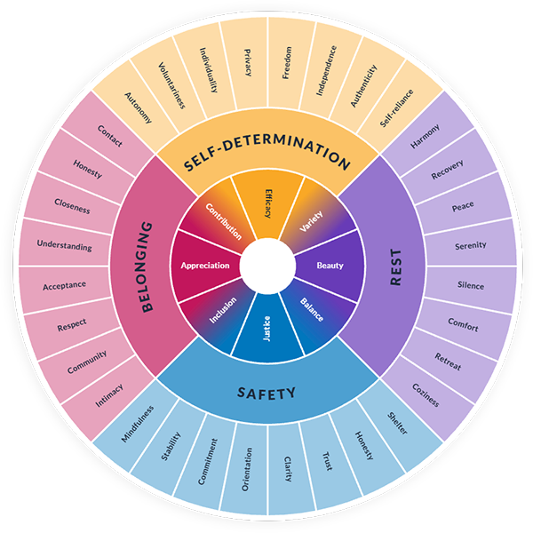

# Wheel of Needs / Bedürfnisrad

An interactive, printable Wheel of Needs for non-violent communication (NVC).

## Features
- **Multilingual:** English & German.
- **Themes:** Vibrant Humanist, Pastel, Retro, Sunset.
- **Interactive:** Zoom, pan, and click segments.
- **Export:** Print-optimized and SVG download.

## Usage
Simply open `index.html` in your browser.
